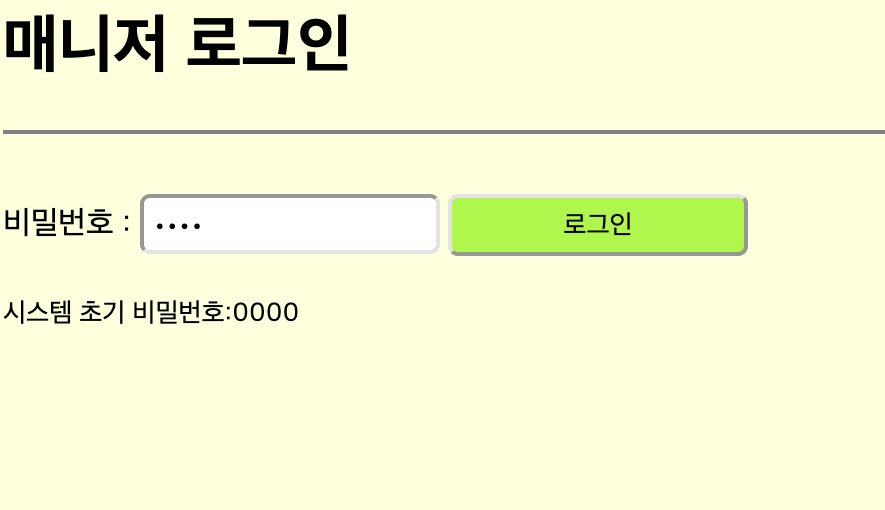
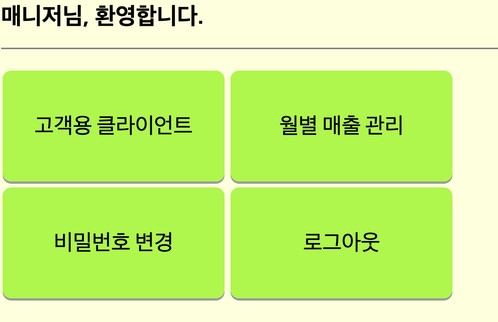
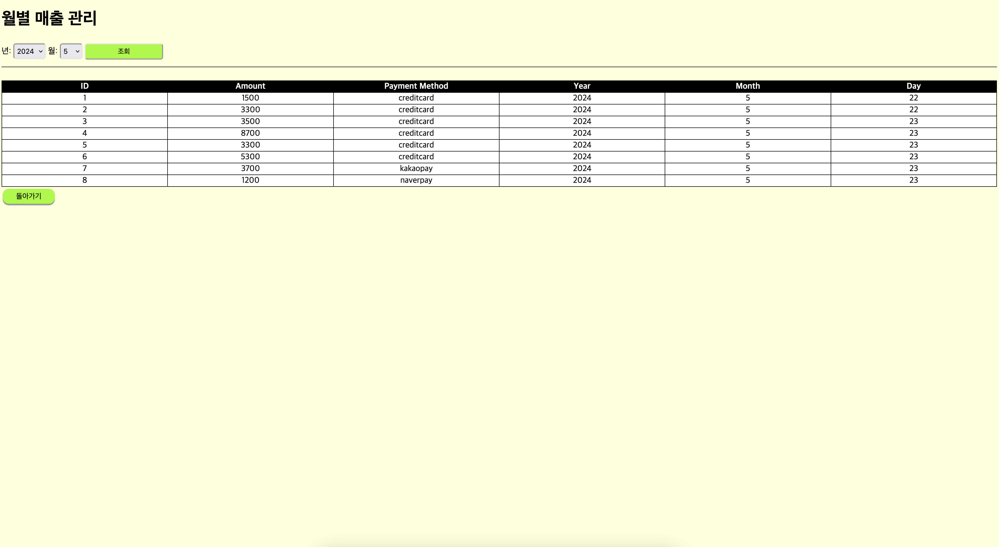
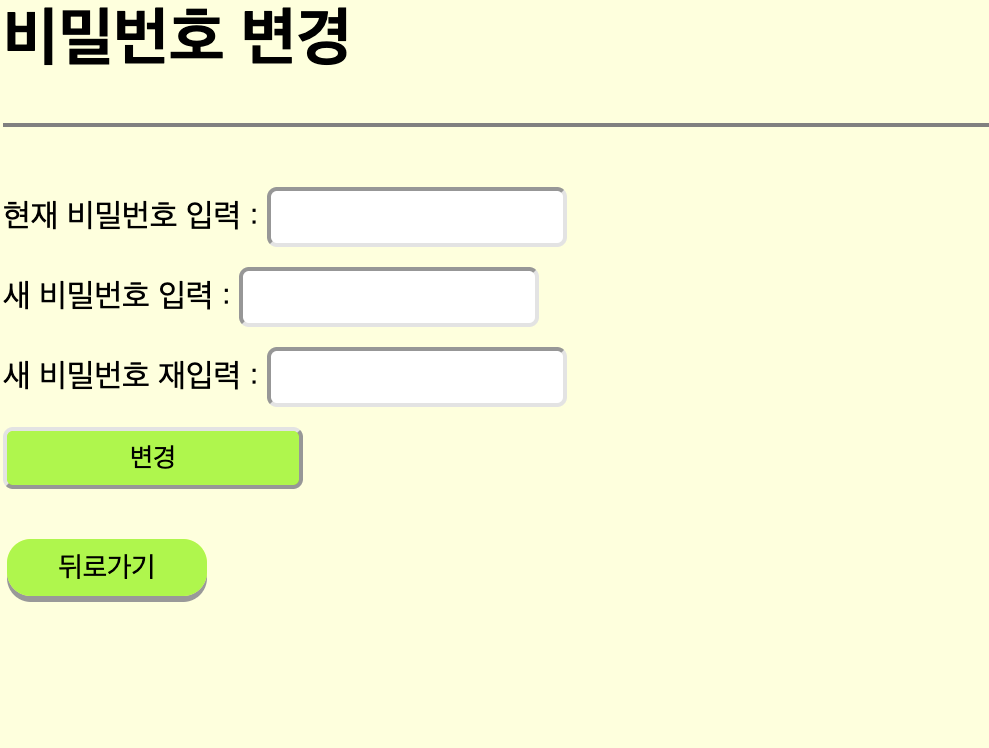
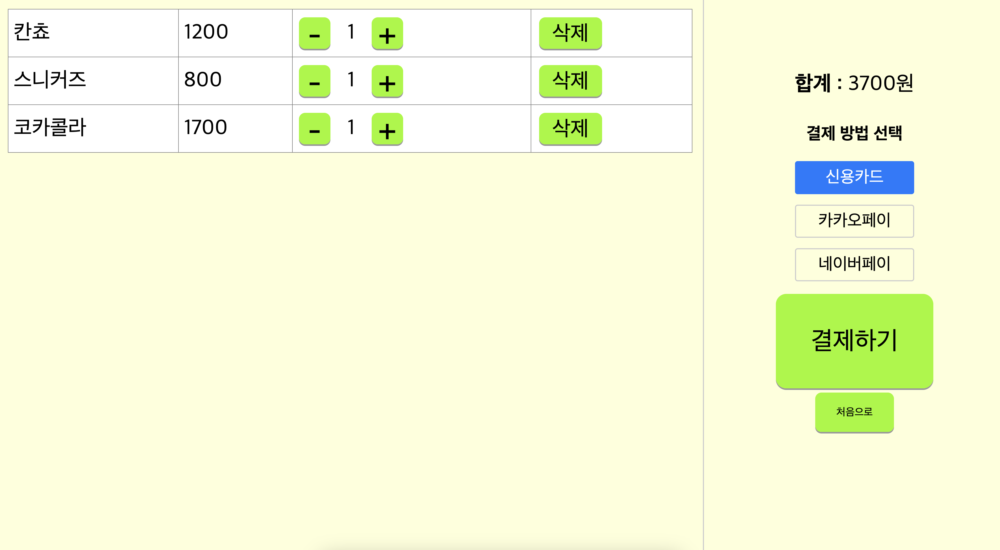
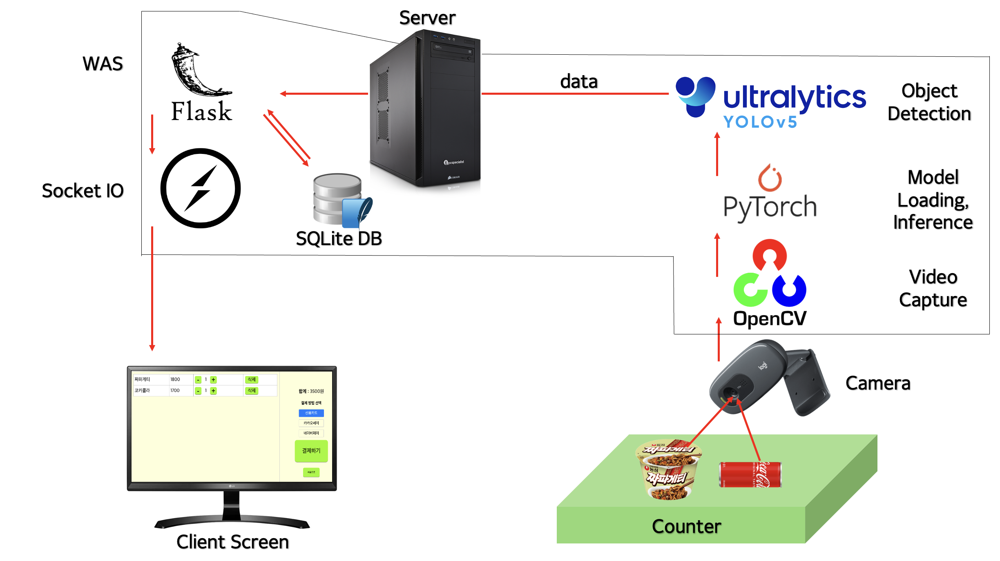
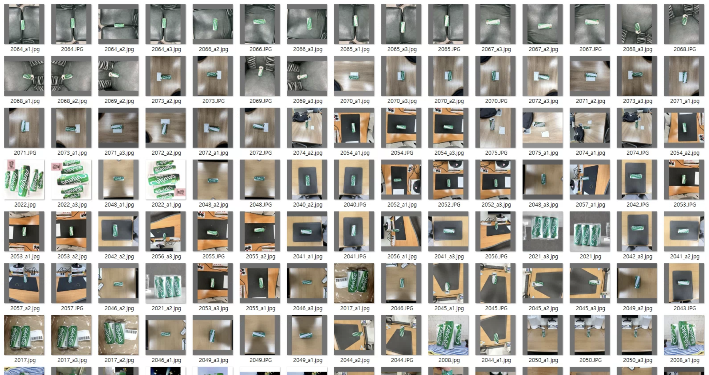
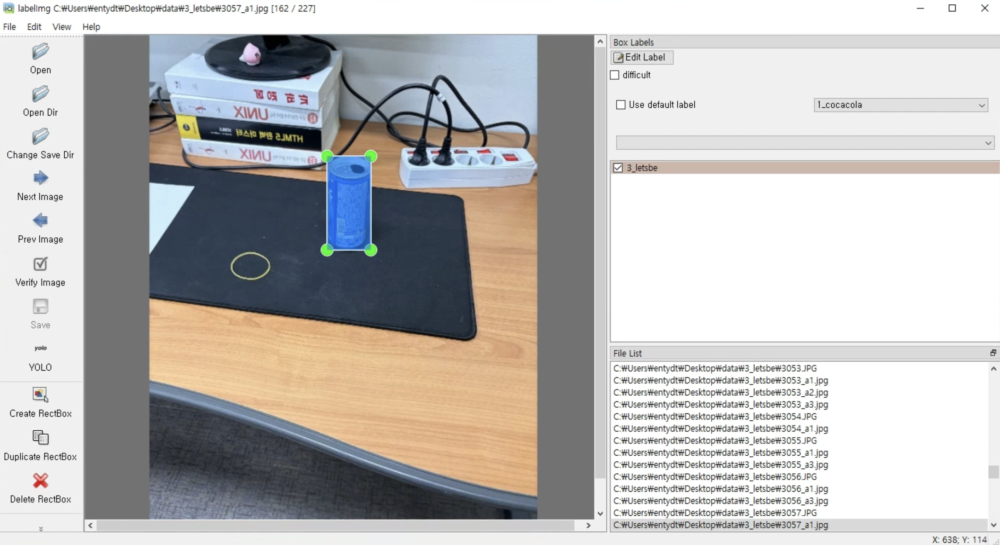
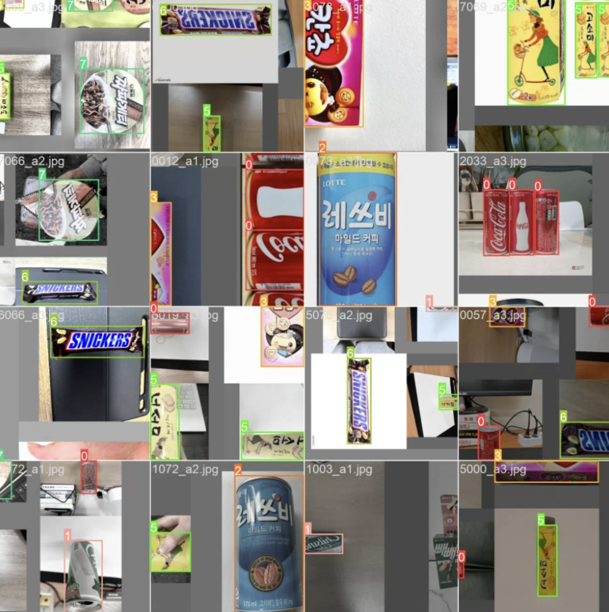
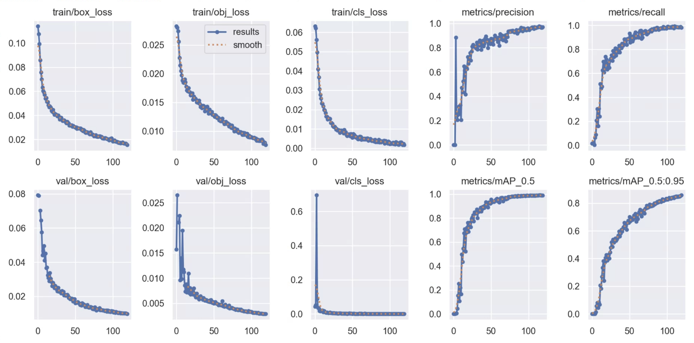

# 편의점 자동 계산 시스템
## Convenience Store Auto Checkout System

* 실시간으로 계산대 위의 물건을 카메라로 인식하여 자동으로 계산해 주는 시스템입니다.    
* A system that automatically calculates the items on the counter in real-time using camera recognition.  
* 개발 동기 : 현재 편의점들의 셀프 계산대 방식은 바코드를 일일이 찍어 계산하는 방식으로, 귀찮다는 문제점이 있습니다. 따라서 이를 해결하기 위해 자동 인식 시스템을 개발하게 되었습니다.  
* 아래 사진을 클릭하면 YouTube 비디오로 이동합니다.

## Contents
- [Preparation](#preparation)
- [How To Use](#how-to-use)
- [Detail](#detail)
- [References](#references)
- [License](#license)
---

## Preparation
> 0. `$ git clone https://github.com/kraftenty/cvs-auto-checkout-system.git` 로 다운로드 받은 다음 해당 디렉토리로 이동하세요.
>
> 1. `requirements.txt` 파일에 적혀 있는 파이썬 라이브러리를 pip 등을 통해 설치하세요.  
>     `$ pip install -r requirements.txt` 명령어로 한 번에 설치할 수도 있습니다.
>
> 2. `$ python app.py` 명령어로 애플리케이션을 실행하세요.  
>  
> 3. 웹 브라우저에 URL : `127.0.0.1:65535` 로 접속하세요.

---
## How To Use
> 1. 매니저 비밀번호를 입력하고 로그인합니다. 초기 비밀번호는 `0000`입니다.
> 
>  
> 2. 메인 화면입니다. `고객용 클라이언트`, `월별 매출 관리`, `비밀번호 변경`, `로그아웃` 을 선택할 수 있습니다.
> 
>  
> 3. 월별 매출 관리 화면입니다. DB를 조회하여 선택된 년/월의 매출을 테이블 형태로 편리하게 조회할 수 있습니다.
> 
>  
> 4. 매니저 비밀번호 변경 화면입니다.
> 
>  
> 5. 고객 계산 화면입니다. 인식된 상품이 자동으로 테이블 형태로 표시되며, `+` `-` 버튼을 눌러 수량을 조정하고 `삭제` 버튼을 눌러 삭제할 수 있습니다. 
> 결제 방법을 `신용카드`, `카카오페이`, `네이버페이` 중에 선택한 후 `결제하기` 버튼을 눌러 결제합니다.
> 

---
## Detail
> How System Works  
> 
> 1. 손님이 물건을 계산대 위에 올려놓고, Client Screen의 계산 시작하기 버튼을 누릅니다.
> 2. PyTorch가 미리 학습된 모델 파일을 로드합니다. 
> 3. 카메라가 OpenCV를 통해 계산대 위를 계속해서 찍습니다.
> 4. YOLOv5가 입력되는 프레임에서 객체를 탐지합니다.
> 5. 탐지된 객체는 Socket 통신을 통해 WAS에서 처리하여 실시간으로 Client Screen에 목록으로 표시됩니다.
> 6. 손님이 Client Screen에서 결제 수단을 고르고 결제 버튼을 누르면, DB에 결제 시간과 금액, 그리고 결제 수단이 저장됩니다.

   
> System Environment  
> CPU : Ryzen R5 5600G  
> MEM : 32GB Memory  
> GPU : RTX 4060 - 8GB VRAM  
  
> Model Training   
> 
> 우선 이미지 학습을 위해 총 1,738장의 사진을 찍었습니다. (8개 클래스)  
> 클래스의 종류는 다음과 같습니다.  
> `코카콜라`, `칠성사이다`, `레쓰비`, `칸쵸`, `빼빼로`, `고소미`, `스니커즈`, `짜파게티`  
> 
>  
> 그 다음, `labelImg`를 이용하여 이미지들을 라벨링합니다.   
> 
>  
> 라벨링한 이미지들과 텍스트 파일들을 train 80%, validation 15%, test 5% 비율로 분할하고, YOLOv5를 이용하여 학습을 돌립니다.  
> Epoch = 120회, 이미지 크기 = 640*640, batch = 16, model = yolo5L
> 
> 

---
## References
- ChatGPT 4.0o
- Github Copilot
- YOLOv5  (https://github.com/ultralytics/yolov5)
---
## License
- MIT License
- Made by `Ko Kyeong Tae` ( `kraftenty` )
- If you have questions, feel free to email `kraftenty@gmail.com`.